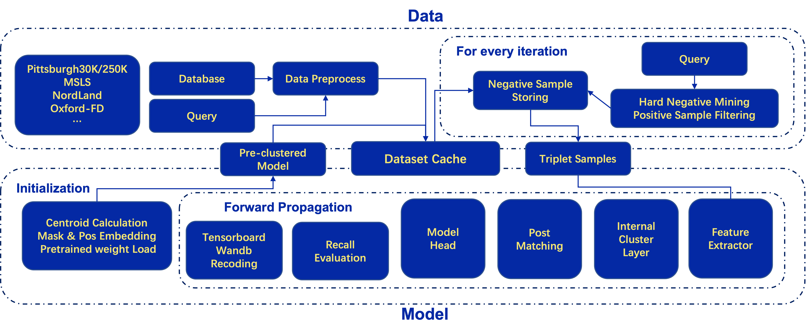

## PR-X

PR-X is a clear, easy-used, all-in-one open source project for research on Visual Place Recognition, the cross-modality models will also be supported in the future.

### Changelog

[2022-11-06]: Beta 0.1 version released.

* Add the support of NetVLAD on MSLS, Pittsbuigh30/250K and NordLand datasets.
* Building the entire skeleton.

### Structure Design

Compare to previous benchmark or framework, we can support both image to image and sequence to sequence model. As a specific task for the contrastive learning, we will also provide different pretext task for training, for example, classification or triplet loss training

During the developing process, we take the following repos for the reference of the structure design. We would like to express our sincerely appreciation.

- [OpenPCDet](https://github.com/open-mmlab/OpenPCDet)
- [NetVLAD](https://github.com/Nanne/pytorch-NetVlad)

For a typical, view the place recognition as a contrastive learning, the pipeline of our implementation can be visualized like: 

  

### Model Zoo

The full structure are cuda and faiss accelerated, here is the model we support so far. The training time is measured with a single 3090 GPU and PyTorch 1.8. Sepcific environment requirement will be released soon.

For MSLS dataset, we here use the Melbourne as the training set and evaluate on Amman subset.

The download of model will quickly be available.

- For Pittsburgh30K

|                | Training time | Recall@1 | Recall@5 | Recall@20 | Download |
| :------------: | :-----------: | :------: | :------: | :-------: | :------: |
| NetVLAD(VGG16) |     13.6h     |   84.8   |   94.9   |   95.1    |          |

- MSLS

|                | Training time | Recall@1 | Recall@5 | Recall@20 | Download |
| :------------: | :-----------: | :------: | :------: | :-------: | :------: |
| NetVLAD(VGG16) |     12.8h     |   23.1   |   33.8   |   39.8    |          |

- NordLand

|                | Training time | Recall@1 | Recall@5 | Recall@20 | Download |
| -------------- | :-----------: | :------: | :------: | :-------: | :------: |
| NetVLAD(VGG16) |     15.1h     |   57.1   |   77.1   |   85.4    |          |
